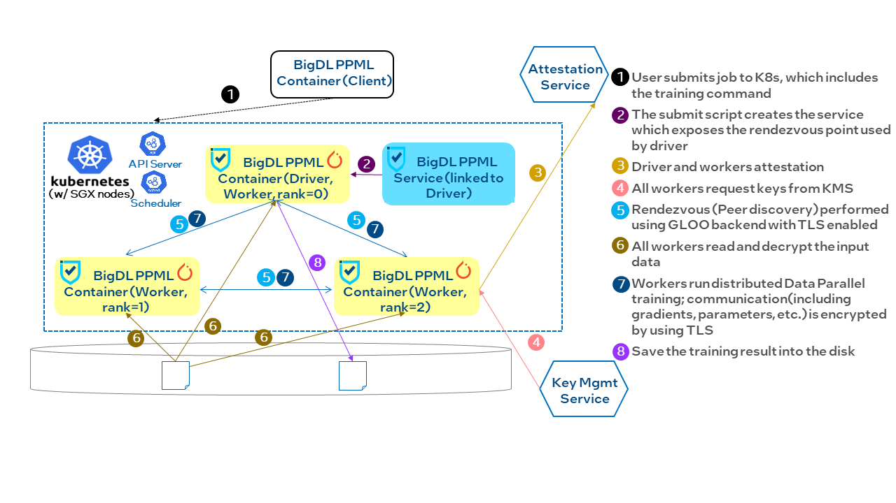
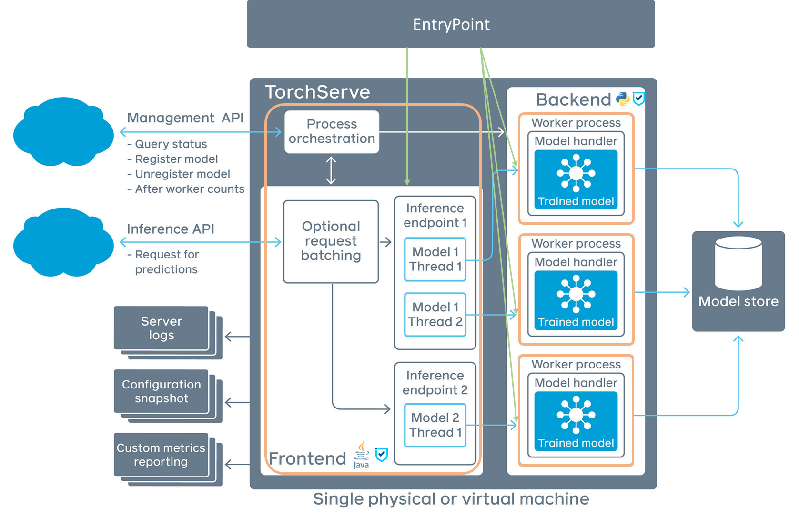

# **BigDL PPML on TDX**

## Overview

[PPML](https://bigdl.readthedocs.io/en/latest/doc/PPML/Overview/ppml.html) (Privacy Preserving Machine Learning) in [BigDL 2.0](https://github.com/intel-analytics/BigDL) provides a Trusted Cluster Environment for secure Big Data & AI applications, even in an untrusted cloud environment. By combining Intel Trust Domain Extensions (TDX) with several other security technologies (e.g., attestation, key management service, private set intersection, federated learning, homomorphic encryption, etc.), BigDL PPML ensures end-to-end security enabled for the entire distributed workflows, such as Apache Spark, Apache Flink, XGBoost, TensorFlow, PyTorch, etc.


## How it works

PPML ensures security for all dimensions of the data lifecycle: data at rest, data in transit, and data in use. Data being transferred on a network is `in transit`, data in storage is `at rest`, and data being processed is `in use`.


PPML protects computation and memory by Trusted Domains, storage (e.g., data and model) by encryption, network communication by remote attestation and Transport Layer Security (TLS), and optional Federated Learning support.


<!-- TODO: Modify -->
With BigDL PPML, you can run trusted Big Data & AI applications
- **Trusted Spark SQL & Dataframe**: with trusted Big Data analytics and ML/DL support, users can run standard Spark data analysis (such as Spark SQL, Dataframe, MLlib, etc.) in a secure and trusted fashion.
- **Trusted ML (Machine Learning)**: with trusted Big Data analytics and ML/DL support, users can run distributed machine learning (such as MLlib, XGBoost etc.) in a secure and trusted fashion.
- **Trusted DL (Deep Learning)**: with Trusted Deep Learning Toolkit, users can run secured end-to-end PyTorch training using either single machine or cloud-native clusters in a trusted execution environment. 

## Get Started

### Prepare TDX environment

Prepare your environment first, including TDVM orchestration, K8s cluster setup, key management service (KMS) ,attestation service (AS) setup and BigDL PPML client container preparation. **Please follow the detailed steps in** [Prepare Environment](https://github.com/intel-analytics/BigDL/blob/main/ppml/docs/prepare_environment.md). 

<!-- TODO: It may be appropriate to add TDX-specific environment setup information on the above website -->


### BigDL PPML End-to-End Distributed PyTorch Training

In this section, we will use PyTorch's DistributedDataParallel module to fine-tuning the [PERT model](https://github.com/ymcui/PERT). This example will be used to demonstrate the entire BigDL PPML end-to-end distributed PyTorch training workflow.



#### Step 1. Prepare your PPML image for the production environment

To build a secure PPML image for a production environment, BigDL prepared a public base image that does not contain any secrets. You can customize your image on top of this base image.

1. Prepare BigDL Base Image

    Users can pull the base image from dockerhub or build it by themselves. 

    Pull the base image
    ```bash
    docker pull intelanalytics/bigdl-ppml-trusted-deep-learning-gramine-base:2.2.0
    ```

2. Build Custom Image

    When the base image is ready, you need to generate your enclave key which will be used when building a custom image. Keep the enclave key safe for future usage.

    Running the following command to generate the enclave key `enclave-key.pem`, which is used to launch and sign SGX Enclave. 

    ```bash
    cd BigDL/ppml/trusted-deep-learning/ref
    openssl genrsa -3 -out enclave-key.pem 3072
    ```

    When the enclave key `enclave-key.pem` is generated, you are ready to build your custom image by running the following command: 

    ```bash
    # Under BigDL/ppml/trusted-deep-learning/ref dir
    # modify custom parameters in build-custom-image.sh
    ./build-custom-image.sh
    cd ..
    ```

    Note: you can also customize the image according to your own needs, e.g. install third-parity python libraries or jars.

#### Step 2. Encrypt and Upload Data

Encrypt the input data of your Big Data & AI applications (here we use PyTorch) and then upload encrypted data to the Network File System (NFS) server. More details in [Encrypt Your Data](https://github.com/intel-analytics/BigDL/tree/main/ppml/trusted-deep-learning#encryption--decryption).

1. Download the input data `seamew/ChnSentiCorp` from [huggingface](https://huggingface.co/datasets/seamew/ChnSentiCorp).


2. Encrypt `seamew/ChnSentiCorp` datasets. The encryption of the datasets should be done in a trusted environment. As for the keys that are used for encryption, we choose to request an encryption key from EHSM (our choice of KMS). See this [example](https://github.com/intel-analytics/BigDL/blob/branch-2.2/ppml/trusted-deep-learning/base/load_save_encryption_ex.py) for detailed steps.

The `patch_encryption()` function used in the example script is provided by `bigdl-nano`. Check [here](https://bigdl.readthedocs.io/en/latest/doc/PythonAPI/Nano/pytorch.html#bigdl.nano.pytorch.patching.patch_encryption) for detailed information.

#### Step 3. Build Distributed PyTorch training script

To build your own Distributed PyTorch training script, you can refer to the official [tutorial](https://pytorch.org/tutorials/intermediate/ddp_tutorial.html).  The code we use for fine-tuning PERT model can be found [here](https://github.com/intel-analytics/BigDL/blob/main/ppml/trusted-deep-learning/base/pert.py).


#### Step 4. Submit Job

When the Big Data & AI application and its input data is prepared, you are ready to submit BigDL PPML jobs. We have prepared a [python script](https://github.com/intel-analytics/BigDL/blob/main/python/nano/src/bigdl/nano/k8s/bigdl_submit.py) which can be used to submit training jobs.

The job submit script is also included in the `intelanalytics/bigdl-ppml-trusted-deep-learning-gramine-base:2.2.0` image so that it should already been included in your custom image. The default location for the script is `/usr/local/lib/python3.7/dist-packages/bigdl/nano/k8s/bigdl_submit.py`.


#### Step 6. Monitor job and check results

Once the job has been scheduled and booted successfully, you can monitor the training progress by check the logs of the kubernetes' pod.

If you want to save the trained model in an encrypted form, you can choose to pass a keyword argument `encryption_key` into patched `torch.save` method. In our situation, the `encryption_key` is retrieved from EHSM in a trusted execution environment. Check the following code for an example:

```python

from bigdl.nano.pytorch.patching import patch_encryption
from bigdl.ppml.kms.ehsm.client import get_data_key_plaintext

patch_encryption()

def get_key():
    return get_data_key_plaintext(EHSM_IP, EHSM_PORT, encrypted_primary_key_path, encrypted_data_key_path)

key = get_key()
# Save the trained model in encrypted form
torch.save(model.state_dict(), "pert.bin", encryption_key=key)
```


### BigDL PPML End-to-End Deep-learning Serving Service with TorchServe
In this section, we will go through the entire workflow to deploy a trusted Deep-Learning Serving (hereinafter called DL-Serving) service that provide functionality to classifying the chinese sentiment of various reviews from websites using [TorchServe](https://pytorch.org/serve/).



#### Step 1. Prepare your PPML image for production environment


To build a secure PPML image for a production environment, BigDL prepared a public base image that does not contain any secrets. You can customize your image on top of this base image.

1. Prepare BigDL Base Image

    Users can pull the base image from dockerhub or build it by themselves. 

    Pull the base image
    ```bash
    docker pull intelanalytics/bigdl-ppml-trusted-dl-serving-gramine-base:2.2.0
    ```

2. Build Custom Image

    When the base image is ready, you need to generate your enclave key which will be used when building a custom image. Keep the enclave key safe for future usage.

    Running the following command to generate the enclave key `enclave-key.pem`, which is used to launch and sign SGX Enclave. 

    ```bash
    cd BigDL/ppml/trusted-dl-serving/ref
    openssl genrsa -3 -out enclave-key.pem 3072
    ```

    When the enclave key `enclave-key.pem` is generated, you are ready to build your custom image by running the following command: 

    ```bash
    # Under BigDL/ppml/trusted-dl-serving/ref dir
    # modify custom parameters in build-custom-image.sh
    ./build-custom-image.sh
    cd ..
    ```

    Note: you can also customize the image according to your own needs, e.g. install third-parity python libraries or jars.


<!-- TODO: encrypt?-->
#### Step 2. Prepare Model Archive file and config file

Same as using normal TorchServe service, users need to prepare the `Model Archive` file using `torch-model-archiver` in advance.  Check [here](https://github.com/pytorch/serve/tree/master/model-archiver#torch-model-archiver-for-torchserve) for detail instructions on how to package the model files into a `mar` file.

TorchServe uses a `config.properties` file to store configurations. Examples can be found [here](https://pytorch.org/serve/configuration.html#config-model). An important configuration is `minWorkers`, the start script will try to boot up to `minWorkers` backends.

To ensure end-to-end security, the SSL should be enabled.  You can refer to the official [document](https://pytorch.org/serve/configuration.html#enable-ssl) on how to enable SSL.

#### Step 3. Start TorchServe service

In this section, we will try to launch the TorchServe service in Trusted Domains.  The example `config.properties` is shown as follows:

```text
inference_address=http://127.0.0.1:8085
management_address=http://127.0.0.1:8081
metrics_address=http://127.0.0.1:8082
grpc_inference_port=7070
grpc_management_port=7071
model_store=/ppml/
#initial_worker_port=25712
load_models=NANO_FP32CL.mar
enable_metrics_api=false
models={\
  "NANO_FP32CL": {\
    "1.0": {\
        "defaultVersion": true,\
        "marName": "NANO_FP32CL.mar",\
        "minWorkers": 2,\
        "workers": 2,\
        "maxWorkers": 2,\
        "batchSize": 1,\
        "maxBatchDelay": 100,\
        "responseTimeout": 1200\
    }\
  }\
}
```

Assuming the above configuration file is stored at `/ppml/tsconfigfp32cl`, then to start the TorchServe Service:

 ```bash
 bash /ppml/torchserve/start-torchserve.sh -c /ppml/tsconfigfp32cl -f "0" -b "1,2"
 ```
As introduced in this performance tuning [guild](https://tutorials.pytorch.kr/intermediate/torchserve_with_ipex#efficient-cpu-usage-with-core-pinning-for-multi-worker-inference), we also pinned the cpu while booting up our frontend and backends. The `"-f 0"` indicates that the frontend will be pinned to core 0, while the `"-b 1,2"` indicates that the first backend will be pinned to core 1, and the second backend will be pinned to core 2.


#### Step 4. Access the service using https requests

After the service has booted up, we can access the service using https requests.  Here we show a simple benchmark result using the [wrk](https://github.com/wg/wrk) tool.  The result with 5 threads and 10 connections are:

```text
Running 5m test @ http://127.0.0.1:8085/predictions/NANO_FP32CL
  5 threads and 10 connections
  Thread Stats   Avg      Stdev     Max   +/- Stdev
    Latency   355.44ms   19.27ms 783.08ms   98.86%
    Req/Sec     6.42      2.69    10.00     49.52%
  8436 requests in 5.00m, 1.95MB read
Requests/sec:     28.11
Transfer/sec:      6.67KB
```


## Recommended Hardware
The hardware below is recommended for use with this reference implementation.

Intel® 4th Gen Xeon® Scalable Performance processors or later

## Learn More
[BigDL PPML](https://github.com/intel-analytics/BigDL/tree/main/ppml)
[Tutorials](https://bigdl.readthedocs.io/en/latest/doc/PPML/Overview/examples.html)
[TDX whitepaper](https://www.intel.com/content/dam/develop/external/us/en/documents/tdx-whitepaper-v4.pdf)


## Support Forum

- [Mail List](mailto:bigdl-user-group+subscribe@googlegroups.com)
- [User Group](https://groups.google.com/forum/#!forum/bigdl-user-group)
- [Github Issues](https://github.com/intel-analytics/BigDL/issues)
---